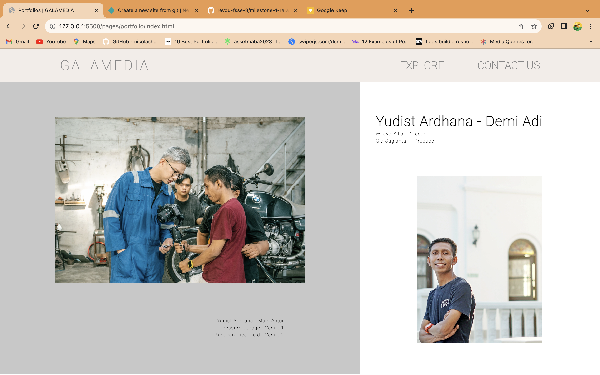
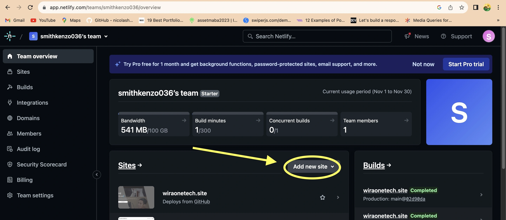
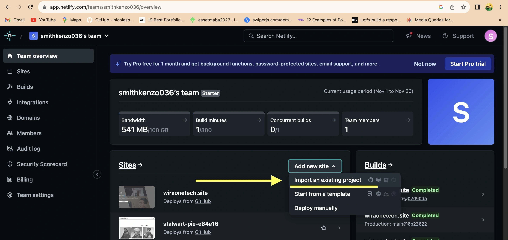
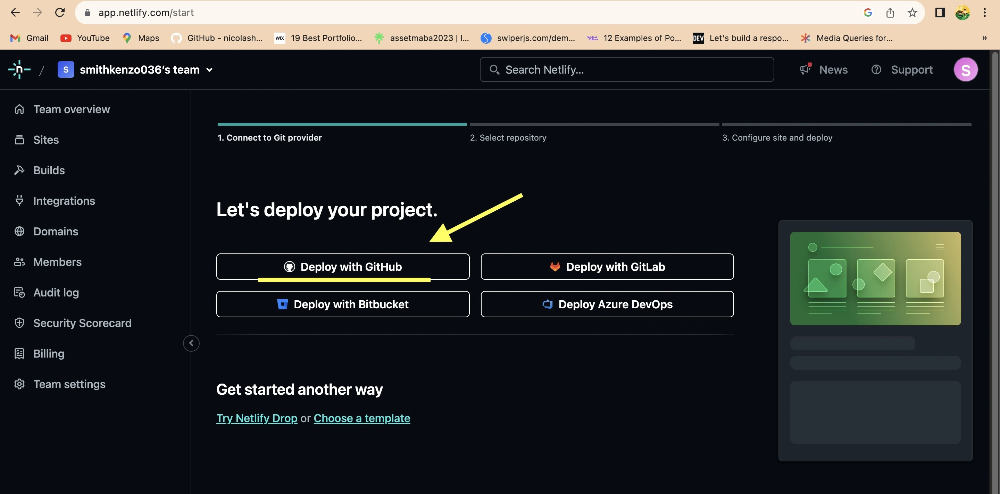
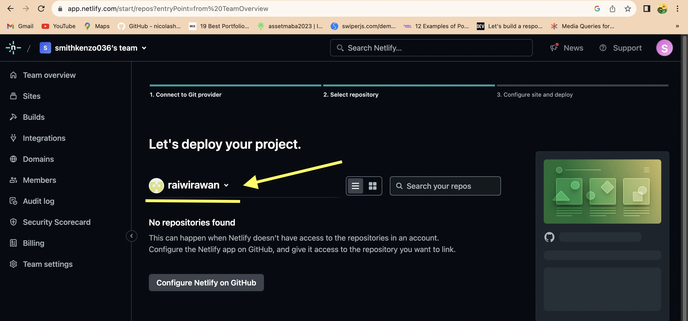
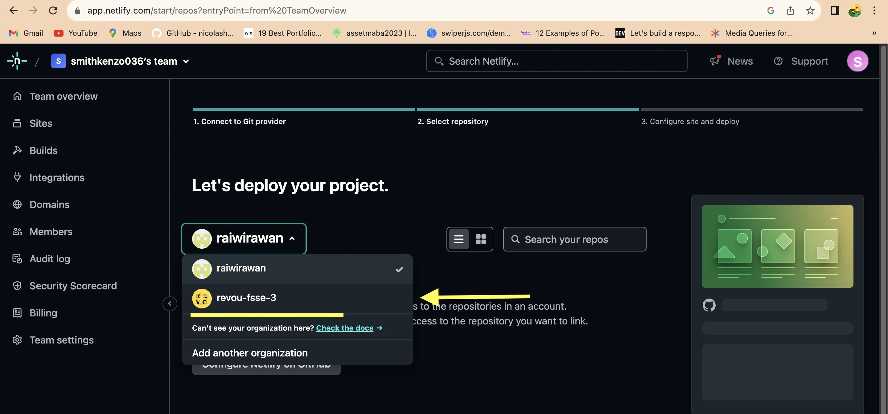
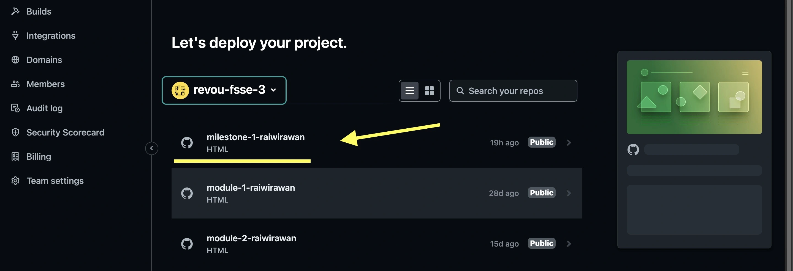
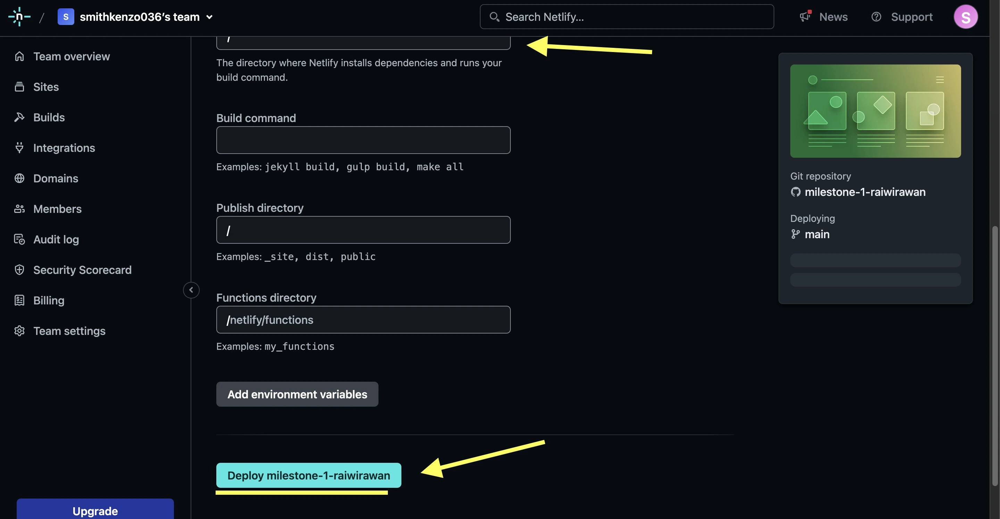
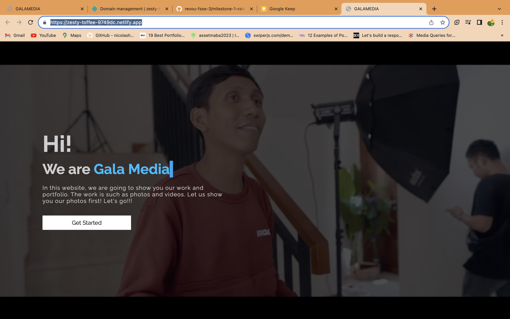
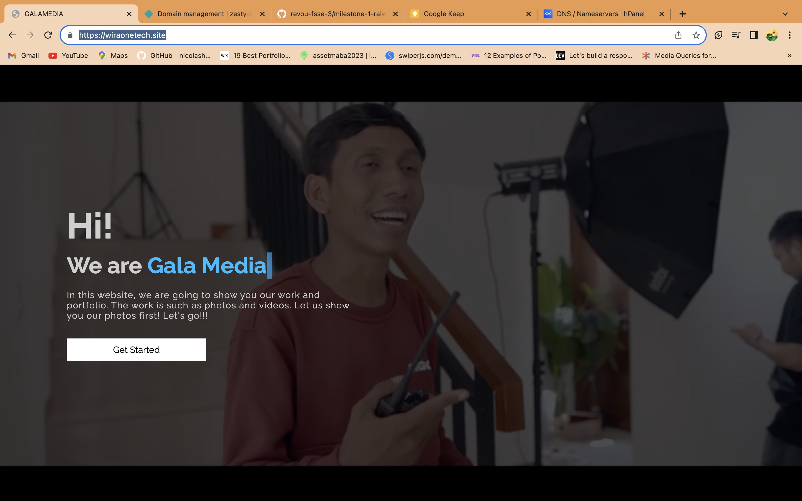

# DOCUMENTATION OF WIRAONETECH.SITE



## I. MY SOCIAL MEDIA

<h3 align="left"><a href="https://www.linkedin.com/in/raiwirawan/"> @raiwirawan</a></h3>

<h3 align="left"><a href="https://www.instagram.com/raiwirawann/"> @raiwirawann</a></h3>

---

## II. WEB STRUCTURE

I have 2 different pages on my website, but they are related to each other, here is the structure of the two pages :

### II.I. MAIN PAGE

- MAIN
  - Video Background
  - Introduction

### II.II. PORTFOLIO PAGE

- Header
  - Navbar
- Main
  - Porfolio section 1
  - Porfolio section 2
  - Porfolio section 3
  - Contact Us section
- Footer

---

## III. LANGUAGES

- HTML
- CSS
- JavaScript

---

## IV. EXTERNAL LIBRARIES/COMPONENTS

- Carousel HTML CSS JavaScript
- Typing with JS

---

## V. DEVELOPMENT PROCESS

You will need a github account to clone this repository, make sure you're connected to github.

1. Clone this repository

```
git clone https://github.com/revou-fsse-3/milestone-1-raiwirawan.git
```

2. Develop & modify the website with your personal information, once it's done you will need to push it.

```
git add . // to bring all unstaged changes to staged changes
git commit -m "Commit Message" // to commit the changes in local
git push origin main // push all the changes into your remote repository
```

## VI DEPLOYMENT PROCESS

The project has been successfully deployed using Netlify. You can access the production version of the website by following this link: [https://wiraonetech.site](https://wiraonetech.site) or [this link](https://wiraonetech.site).

### VI.I. Deploy to Netlify

1. Go to Netlify.com and log in if you already have an account or register if you don't have an account.

2. Add a new website from an existing project.
   

3. Choose import from existing project.
   

4. Choose from GitHub.
   

5. Choose the repositories account.
   

6. Choose the RevoU repos account
   

7. Choose repository that you want to deploy
   

8. Let's click the deploy button and start deploying your project
   

9. Result :
   

### VI.II. Buy Domain at Niagahoster.co.id

1. Login to Niagahoster.co.id, and make an account. Log in if you already have an account.

2. Search domain name if the name is exist for use or not.

3. Buy the domain using payment method that you want to use.

4. Wait until the payment success.

5. If you are still confused about how, you can browse or look for it on YouTube.

### VI.III. Custom Domain

1. Your site must been deployed on Netlify.

2. You must have purchased or own a domain that can be used at Niagahoster.co.id

3. If you already have a domain, you will be able to change the existing nameservers so you can connect to the hosting location.

4. If so, then you have to go to Netlify and find the website that has been deployed.

5. Then open "Domain Management", and find the domain that you have purchased at Niagahoster

6. Then you will be given 4 DNS that you have to enter into Niagahoster in order to connect. Change the entire default DNS of your domain on Niagahoster.

7. After that, wait a few hours until your website on Netlify and the Niagahoster domain are connected.

8. RESULT : 

## VII. PREVIEW

### VII.I. PREVIEW IMAGES

1. Main Page
   

2. Portfolio Page
   

### VII.II. PREVIEW LINK

Link : https://wiraonetech.site

## VIII. THANKS

Thank you for visiting my repository and reading this documentation. Don't forget to visit the results website! Thank You!
