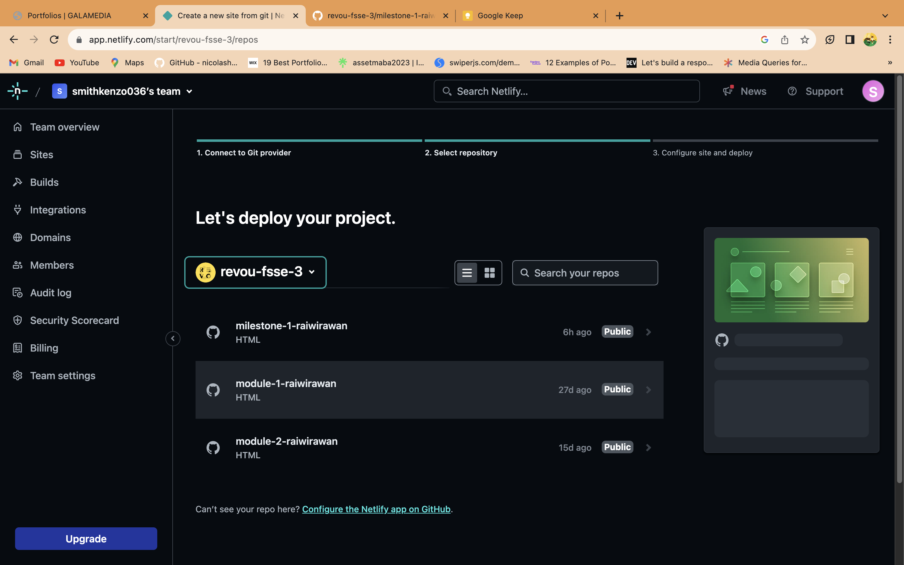

## MY SOCIAL MEDIA

<h3 align="left"><a href="https://www.linkedin.com/in/raiwirawan/"> @raiwirawan</a></h3>

<h3 align="left"><a href="https://www.instagram.com/raiwirawann/"> @raiwirawann</a></h3>

## STRUCTURE 📰

### MAIN PAGE

- MAIN
  - Video Background
  - Introduction

### PORTFOLIO PAGE

- Header
  - Navbar
- Main
  - Porfolio section 1
  - Porfolio section 2
  - Porfolio section 3
  - Contact Us section
- Footer

## INGREDIENTS THAT I'M USING 📜

- HTML
- CSS
- JavaScript
- Internal Source
  - Icon
  - Image

## HOW TO SET UP 📰

You will need a github account to clone this repository, make sure you're connected to github.

1. Clone this repository

```
git clone https://github.com/revou-fsse-3/milestone-1-raiwirawan.git
```

2. Develop & modify the website with your personal information, once it's done you will need to push it.

```
git commit -m "Merge develop into main"
git push origin main
```

## DEPLOYMENT ⚙️

The project has been successfully deployed using Netlify. You can access the production version of the website by following this link: [https://wiraonetech.site](https://wiraonetech.site) or [this link](https://wiraonetech.site).

### Deployment status :

[](https://app.netlify.com/sites/zesty-toffee-9749dc)

1. Connect your account to Netlify !

The first step to deploy in Netlify is creating a new account or use existing account. As a beginner progammer, I would prefer using GitHub account instead.

After you successfully login, you will be redirected to dashboard of Netlify app. In this scenario, you will need to import your existing project from github to netlify. Add new site -> Import existing project -> Connect via GitHub



2. Auto Deploy with Netlify !

One of the benefit using your GitHub account connected to Netlify is that you don't have to worry about re-deploying your project manually, once there are changes that have been pushed in your repository, it will automatically re-deployed by Netlify within second.


3. Domain Registrar with NiagaHoster !

Go to [https://niagahoster.co.id](https://niagahoster.co.id) and log in or create a new account. Check available domain that you wanted and make it yours.


4. Modify your project with favorite customize domain !

Modify your Niaga hoster default NameServer to Netlify NameServer. And don't forget to change the domain address into your Netlify subdomain/domain.


5. Congratulations, You're done !

You should wait within 1x24 hours to let the NiagaHoster setting up the DNS, it could be faster or slower depending on the provider internet that you're using.

Feel free to explore the website and try out the different features. I appreciate any feedback and suggestions to further improve the user experience.

Happy browsing!


## PREVIEW : https://wiraonetech.site
